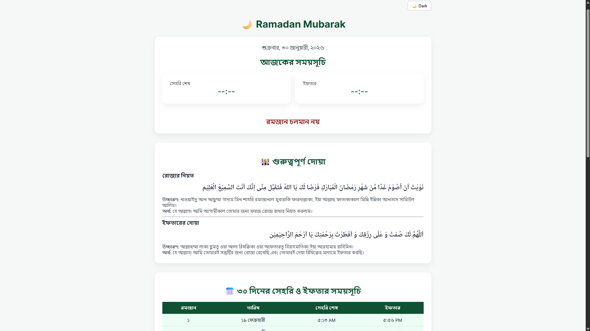

# 🌙 Ramadan Times BD

## Project Description

A modern, responsive web application providing accurate Sehri and Iftar times for Bangladesh during Ramadan.

Built with simplicity, performance, and accessibility in mind.

---

## ✨ Features

- 🕌 **Accurate Sehri & Iftar Times**
- 📅 **Full Monthly Ramadan Schedule**
- ⏳ **Live Countdown** (Sehri & Iftar)
- 🌙 **Light & Dark Mode**
- 🔢 **Bangla Digit Formatting**
- 📱 **Fully Responsive Design**
- 📍 **Location-based Prayer Times (Dhaka, BD)**
- 🎯 **Automatic Today Highlighting**

---

## 🚀 Live Preview

🔗 Check out the live preview of the application here: [Ramadan Times BD](https://ramadantimesbd.vercel.app/)(https://ramadantimesbd.vercel.app/)

---

## 📸 Demo Screenshot

<p align="center">
  
</p>

---

## 🛠 Tech Stack

- **HTML5**
- **CSS3 (Custom responsive layout + Dark mode)**
- **Vanilla JavaScript**
- **AlAdhan Prayer Times API**

---

## 📂 Project Structure

```
├── index.html
├── styles.css
├── wholeYear.js
├── ramadan.js
├── assets/
```

---

## 📦 How It Works

- Fetches prayer time data from the AlAdhan API.
- Dynamically generates the monthly table.
- Automatically detects today's date.
- Updates countdown every second.
- Highlights today's row automatically.

---

## 🔮 Future Improvements

- Multi-city selection
- Multi-language support
- Notification reminders

---

## 👨‍💻 Author

**Niloy Ahsan**
This project was developed by [Niloy Ahsan](https://github.com/niloyahsan1).

---

## 📜 License

This project is licensed under the MIT License. Feel free to use, modify, and distribute it as per the license terms.

---
